# Parcial 1 Sistemas Operativos

**Nombre:** Daniel Perez Garcia 

**Codigo:** A00018200

**Email:**  danielperga97@outlook.com 

## Descarga y verificacion de integridad Debian 9

Descargamos nuestra imagen Iso y verificamos el sumMD5 de la imagen. Para ello nos dirigimos al siguiente enlace: http://cdimage.debian.org/debian-cd/current/amd64/iso-cd/MD5SUMS, obtenemos el que corresponda a nuestra imagen y lo comparamos con el generado por nuestra utilidad.

+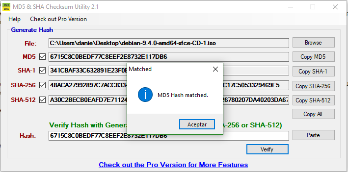


## Proceso de instalacion

1. Creamos nuestra maquina virtual y le asignamos valores de nombre, tamano de memoria, creamos un disco duro virtual del tipo deseado,y le asignamos reservados dinamico o fijo segun nuestras necesidades.

2. Una vez creada nos dirigimos a configuracion,almacenamiento,controlador,unidad optica, y seleccionamos nuestra imagen ISO.

3. Arrancamos nuestra maquina, seleccionamos graphic install y configruamos parametros de idioma,pais,region, etc

4. Seleccionamos los paquetes que desamos intalar y concluimos la instalacion


##Informacion del sistema

Mediante el comando Uname podemos obtener una gran cantidad de informacion acerca del sistema. 

```
uname
Linux
```
nombre del kernel
```
uname -s
Linux
```
nombre del sistema
```
uname -n
Debian
```
version release del kernel 
```
Uname -r 
4.9.0-6-amd64
```
version del kernel
```
uname -v
#1 smp debian 4.9.82-1+deb9u3(2018-03-02)
``` 
arquitectura de la maquina
```
uname -m
x86_64
```
Sistema operativo
``` 
uname -o 
GNU/Linux
``` 

## Configuracion SSH y acceso al sistema

Para una conexion SSH primero debemos configurar una interfaz tipo puente en las opciones de configuracion de red de nuestra maquina virtual e instalar openssh-server. Posteriormente nos dirigimos a putty(en el caso de windows) y realizamos una configuracion como la siguiente: 

+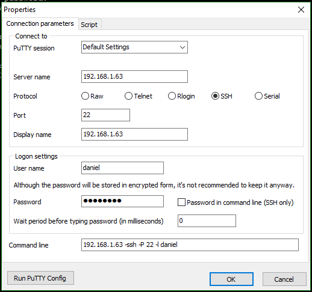

Introducimos la direccion Ip, seleccionamos protocolo SSH, seleccionamos el puerto 22 e introducimos nuestros datos de inicio de sesion.

## Instalando GIT y TIG
Para instalar Git y Tig empleamos los comandos update y upgrade para asegurarnos de tener todos los paquetes necesarios al dia, y una vez hecho esto procedemos a instalarlos:
```
apt-get update
apt-get upgrade
apt-get install git-core
apt-get install tig
```
+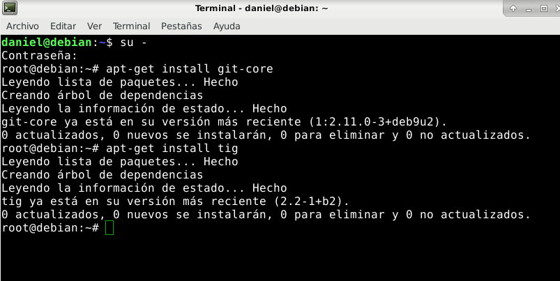

Historial de commits desde tig: 

+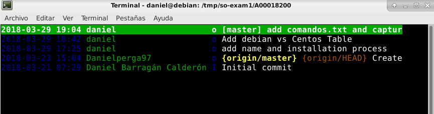


## Exportando la Maquina Virtual
1. Archivo> exportar servicio virtualizado 

+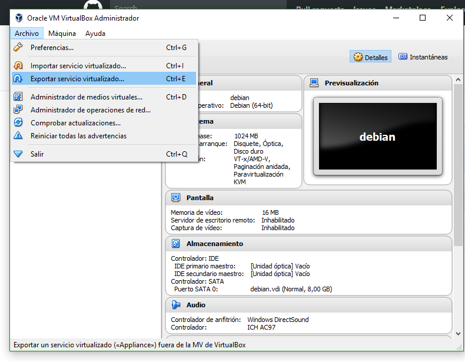

2. seleccionamos la maquina

+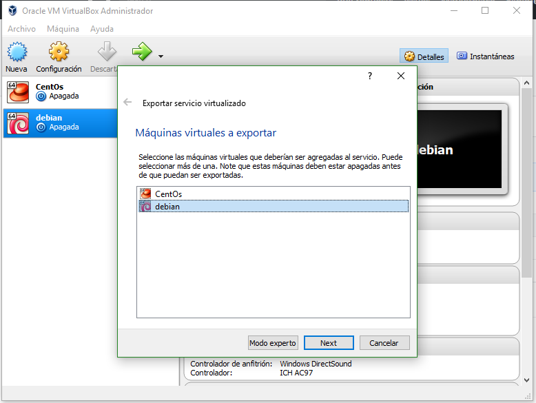

3. configuramos sus valores y la exportamos.

+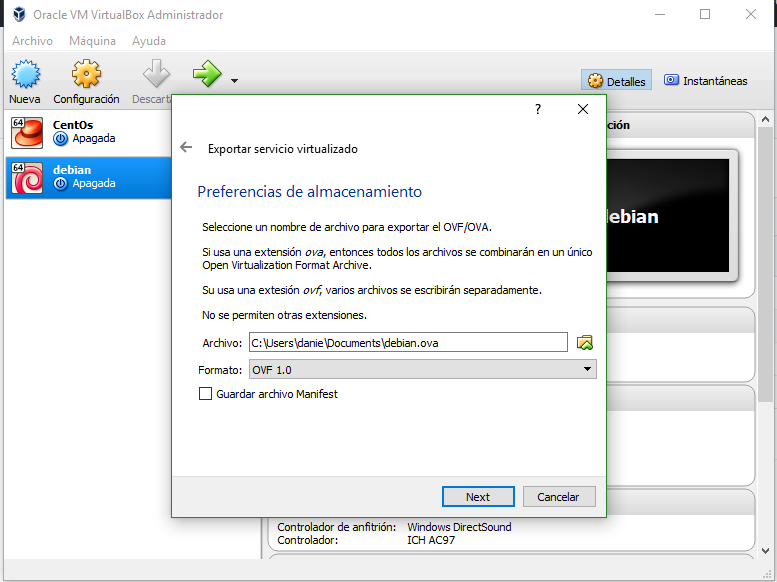

+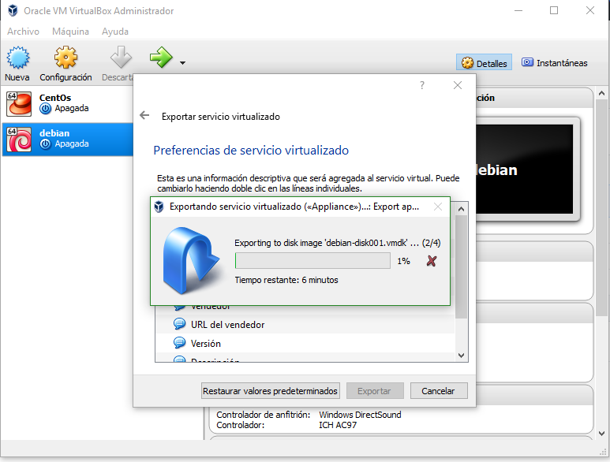

## Importando la Maquina Virtual

1. Archivo> Importar servicio virtualizado

+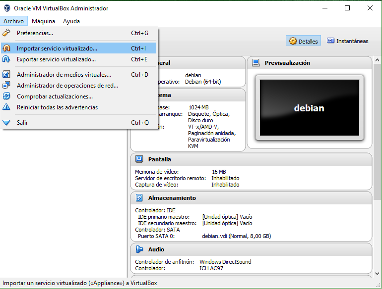

2.seleccionamos el archivo de la maquina virtual (.OVF)

+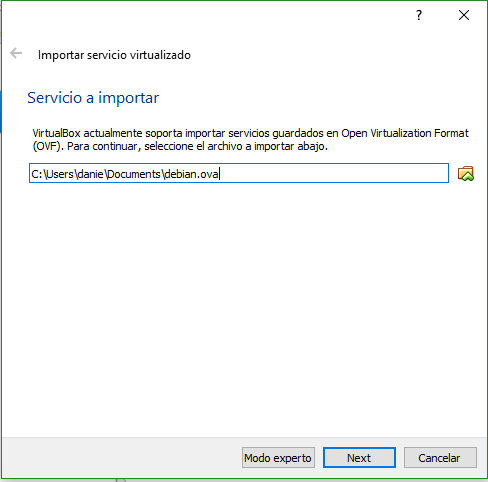

3. Seleccionamos las preferencias de configuracion y la importamos

+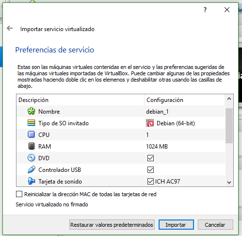

+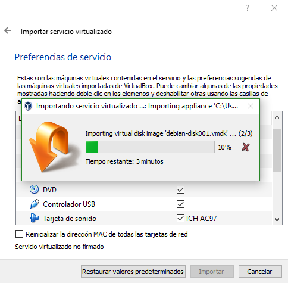


## Comparativa CentOS 7 vs Debian 9

**Caracteristica** | **CentOS 7** | **Debian 9**
---|---|---
Origen |centOs es una distribucion basada en Red Hat Enterprise Linux| Debian es un distro de linux por si mismo, existiendo varias distribuciones basadas en el
Soporte | las versiones de centOS tienen mantenimiento por 10 anos y actualizaciones completas por 6 | las versiones LTS tienen soporte completo por 6 anos
Estabilidad|solo las versiones estables de CentOS son lanzadas, lo que asegura estabilidad sin importar cual se descargue| las versiones LTS son altamente estables, siendo considerado uno de los mas estables del mercado
Comunidad |la comunidad de Centos es mas pequena que las de otros distros de linux, el soporte es poco y la disponibilidad de recursos de aprendizaje | tambien  en el caso de debian su comunidad es relativamente amplia y bastante activa, por lo que actualizaciones, ayuda y soporte son de facil acceso
gestor de paquetes| yum | apt-get o aptitude
Enfoque | es orientado a ser usado en servidores | es de proposito general pero puede adaptarse a distintas necesidades
Popularidad | CentOS es usado en cerca de 3,808,897 websites | Debian es usado en cerca de 3,291,543 sitios web
Peso(version mas sencilla) | ronda los 500 MB | ronda los 300 MB
fecha de lanzamiento | junio 2014 |junio 2017
Nucleos | Centos solo es compatible con el nucleo de linux | debian es compatible con el nucleo de linux y kfreebsd, ademas ofrece soporte no oficial para gnu Hurd
